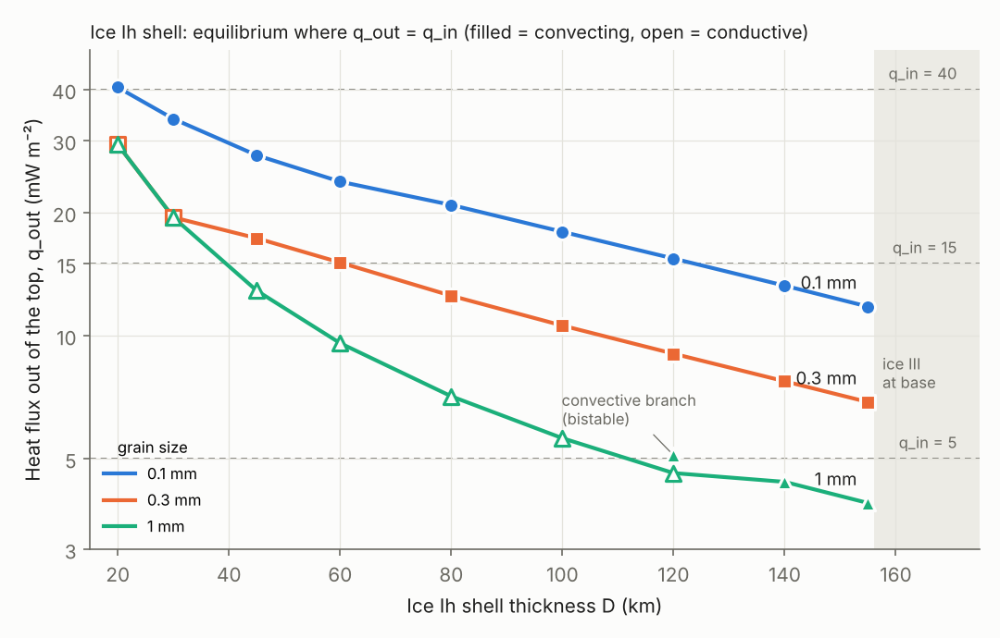
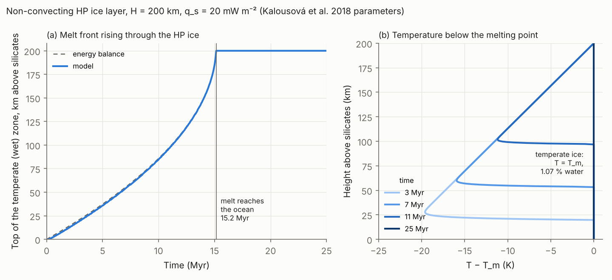

# ganymede-interior

A readable, tested interior-structure and convection model for **Ganymede**, written from scratch in Python. The aim is a code built around ice physics, not adapted from a silicate-mantle code, and growing step by step towards two-phase (ice–water) convection in the high-pressure ice layer.

> Work in progress. Each stage is checked against an analytic or published benchmark before the next one starts.

## Roadmap

| Stage | Content | Benchmark | Status |
|---|---|---|---|
| 0 | 1D structure: density, gravity, pressure, C/MR² fit | Uniform sphere (analytic) | ✅ |
| 0b | Self-consistent H₂O layer: SeaFreeze phases, conductive ice Ih shell, adiabatic ocean / HP ice | Closed-form k = a/T shell; M and C/MR² recovered | ✅ (PlanetProfile comparison pending) |
| 1 | 1D two-phase compaction (McKenzie equations) | Solitary porosity waves: second-order convergence, c = 2A + 1, mass conservation | ✅ |
| 2 | 2D Stokes convection on a staggered grid, T-dependent viscosity | Analytic Stokes flow (order 2, div v ≈ 0); Blankenbach et al. (1989) 1a and 2a within 0.05 % | ✅ |
| 2d | Real ice Ih: Arrhenius diffusion creep (capped), k = 651/T, equilibrium shell thickness | k(T) conduction analytic; cap-insensitivity; transient = steady; SeaFreeze melting curve | ✅ preliminary |
| 3a | Stokes on PETSc: symmetric saddle point, FGMRES + Schur field split | Analytic Stokes; mesh- and contrast-independent iterations (≤ 11 up to η contrast 10⁸) | ✅ |
| 3b | Native DMStag assembly + geometric multigrid on the velocity block | Matrix identical to SciPy assembly; 4 outer / 6 inner iterations from 32² to 512²; 10/5 at η contrast 10⁸ | ✅ |
| 3c | MPI-parallel runs (`scripts/parallel_stokes.py`) | 1, 2, 4 processes: same iterations, same solution (1e-13) | ✅ |
| 3d | 3D DMStag Stokes (MPI, geometric multigrid) | 3D analytic: order 2.0, div v ≈ 1e-15; 4 outer / 6 inner iterations; 3D = 2D when nothing varies in y (η contrast up to 10⁸); 1 vs 2 processes identical | ✅ |
| 3e | Convection on DMStag (2D): PETSc Stokes + energy, steady Picard, MPI | Identical to the SciPy code (ΔT ≈ 1e-10) for Blankenbach 1a and 2a; 1 vs 2 processes identical | ✅ (correct; not yet optimised) |
| 3f | 3D convection | Busse et al. (1994) 3D benchmark | ⬜ |
| 4a | Water percolation through ice, zero compaction length (Kalousová et al. 2018, Eq. 1c–d), 1D | Exact Riemann solutions (shock and rarefaction), converging with resolution; mass conserved to 1e-15 | ✅ |
| 4b | Temperate-ice energy: melting, freezing, T ≤ T_m (operator split), 1D | Heated half-space (analytic); total energy (sensible + latent) conserved to 1e-11 | ✅ |
| 4c | Non-convecting HP ice column: melt generation, percolation, refreezing | Melt-front arrival vs. energy balance (0.1 %); steady state q_s = conduction + latent heat of extracted water | ✅ |
| 4d | Two-phase convection in 2D: mixture Stokes with melt source and bulk-viscosity term, porosity advection, temperate energy | Reproduce Kalousová et al. (2018) reference run | ⬜ |

## First results (pure-water H₂O layer, self-consistent with M and C/MR²)

| Surface heat flux | H₂O layer | Ice Ih shell | Ocean | HP ice | Phase sequence |
|---|---|---|---|---|---|
| 5 mW m⁻² | 809 km | 111 km | 224 km | 474 km | Ih → liquid → V → VI |
| 15 mW m⁻² | 802 km | 39 km | 455 km | 308 km | Ih → liquid → VI |
| 40 mW m⁻² | 799 km | 15 km | 537 km | 247 km | Ih → liquid → VI |

Gravity fixes the *total* H₂O thickness; the heat flux decides how it splits between ocean and high-pressure ice. Assumptions: conductive (non-convecting) Ih shell, adiabatic ocean and HP ice, no salts.

### Meltwater transport through high-pressure ice (Stage 1)

Porosity waves carry water upward in discrete pulses. For rough ice VI parameters (φ₀ = 1 %, Δρ ≈ 120 kg m⁻³), a wave crosses 300 km of HP ice in ~10³–10⁷ yr depending on grain size (10–0.1 mm). The crossing time depends on permeability only, **not** on ice viscosity, which sets the wave width (compaction length ~10 m – 10 km).

### Convection benchmarks (Stage 2)

| Blankenbach et al. (1989) | Nu (this code) | Nu (reference) | v_rms (this code) | v_rms (reference) |
|---|---|---|---|---|
| 1a: Ra = 10⁴, constant η | 4.8846 | 4.8844 | 42.865 | 42.865 |
| 2a: Ra = 10⁴, η contrast 10³ | 10.061 | 10.066 | 480.63 | 480.43 |

Richardson-extrapolated from 64² and 128² grids.

### Ice Ih shell: how thick is it? (Stage 2d, preliminary)

For each shell thickness D the base sits at the ice Ih melting point at the base pressure (SeaFreeze), the surface at 110 K; viscosity is Arrhenius diffusion creep, k = 651/T, steady 2D convection at 64², aspect 1. The shell is in equilibrium where the heat leaving the top, q_out(D), equals the heat arriving from below, q_in. Ice Ih cannot float deeper than ≈ 156 km: below that the base would be ice III.



Equilibrium thickness (km):

| q_in (mW m⁻²) | 0.1 mm grains | 0.3 mm grains | 1 mm grains |
|---|---|---|---|
| 5 | ≥ 156 (Ih–III limit) | ≥ 156 (Ih–III limit) | 112–123 (bistable)* |
| 10 | ≥ 156 (Ih–III limit) | 107 | 58 (cond.) |
| 15 | 124 | 61 | 39 (cond.) |
| 20 | 86 | 29 (cond.) | 29 (cond.) |
| 30 | 39 | 20 (cond.) | 20 (cond.) |
| 40 | 21 | 15 (cond.) | 15 (cond.) |

\* Around 110–125 km the 1 mm shell has two stable steady states (conductive and weakly convecting, Nu ≈ 1.1); which one it is in depends on its history.

Reading: grain size matters more than heat flux. Fine-grained (0.1 mm) ice convects efficiently, so the shell must grow thick (≈ 90–125 km at 15–20 mW m⁻²) before it loses only what it receives, and at ≤ 10 mW m⁻² it reaches the Ih–III limit. Coarse-grained (1 mm) ice barely convects, and the shell settles at a few tens of km.

Caveats (why "preliminary"): ρ, g, α held fixed through the shell; diffusion creep only (no grain-boundary sliding or dislocation creep); pure water (no salts or NH₃, which lower T_b); no tidal heating; steady states only; aspect ratio 1 and 64² grid. Reproduce with `python scripts/shell_equilibrium.py run --grain 0.1` (one grain size, ~20 min) and `python scripts/shell_equilibrium.py plot results/shell_equilibrium.json`.

### Melt in the high-pressure ice layer, without convection (Stage 4c)

The zero-compaction-length model of Kalousová et al. (2018) in a 1D column: 200 km of ice VI, starting at the ocean-interface melting point and heated from below at 20 mW m⁻². The heat from the silicates melts the base, the water rises and refreezes in the colder ice above, and that latent heat warms the ice until a temperate (partially molten) channel reaches the ocean.



- The melt reaches the ocean after **15.2 Myr**, exactly as an energy balance predicts (warming the ice up to the melting curve takes almost all of it).
- After that, 99 % of the basal heat (19.8 of 20 mW m⁻²) leaves as meltwater, ≈ 1.4 mm/yr ≈ 1.4 km of water per Myr; only 0.18 mW m⁻² is conducted along the melting curve.
- The temperate ice holds just 1.07 % water, barely above the 1 % percolation threshold: the permeability law, not the heat flux, fixes how wet it is.

This is the no-convection end-member, a test bed for the two-phase pieces. With μ₀ = 10¹⁵ Pa s the layer convects vigorously, which is Stage 4d. Reproduce with `python scripts/hp_column.py`.

## Install

```bash
pip install -e ".[dev,eos]"
conda install -c conda-forge petsc petsc4py mpi4py   # for Stage 3
pytest              # fast tests (~25 s)
pytest -m slow      # 128² Blankenbach 2a run and the 200 km HP column (~1 min)
```

## Layout

```
src/ganymede/   model code
tests/          benchmarks as unit tests
notebooks/      one notebook per stage, worked through cell by cell
```

## License

MIT
